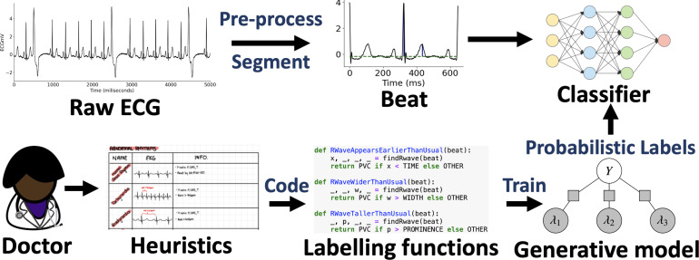
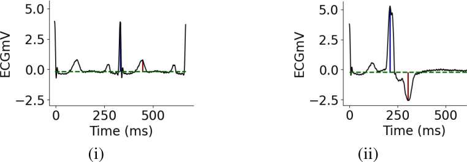
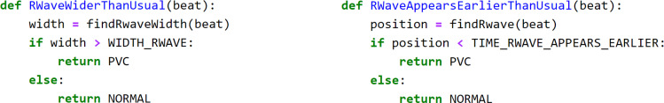
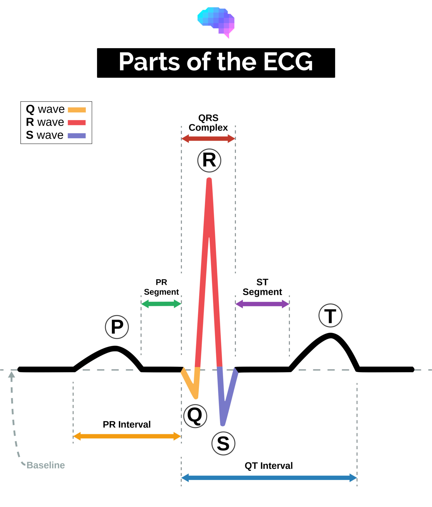

# MIT-BIH Arrhythmia Detection

The following is taken from:

## Background
Electrocardiograms (ECGs) represent a cost-effective, non-invasive yet powerful diagnostic tool for heart disease. While machine learning has shown promise in automating ECG analysis, current approaches rely heavily on large, manually annotated datasets. The point-by-point annotation of abnormal heartbeats is time-consuming, tedious, and expensive - creating a significant bottleneck in developing robust detection systems.

### Challenge Overview
This competition focuses on the critical problem of efficiently labeling abnormal heartbeats using expert-designed heuristics and programmatic weak supervision through the Data Programming framework. Your task is to leverage this approach to identify Premature Ventricular Contractions (PVCs) - a specific type of cardiac arrhythmia.

### Clinical Significance
While isolated, infrequent PVCs are generally benign, frequent occurrences with exceptionally wide QRS complexes may indicate underlying heart disease and potentially lead to sudden cardiac death. Accurate PVC detection can provide critical early warnings for at-risk patients.

### Technical Approach
You will:

- Implement six domain expert-defined heuristics as Labeling Functions (LFs)
- Use Snorkel, an open-source library, to model these heuristics within a factor graph framework
- Generate probabilistic labels for each heartbeat instance
- Develop and train a machine learning model using these weakly supervised labels

## Data Description
The MIT-BIH Arrhythmia Database contains 48 half-hour excerpts of two-channel ambulatory ECG recordings, obtained from 47 subjects studied by the BIH Arrhythmia Laboratory between 1975 and 1979. Twenty-three recordings were chosen at random from a set of 4000 24-hour ambulatory ECG recordings collected from a mixed population of inpatients (about 60%) and outpatients (about 40%) at Boston's Beth Israel Hospital; the remaining 25 recordings were selected from the same set to include less common but clinically significant arrhythmias that would not be well-represented in a small random sample.

### ECG lead configuration
In most records, the upper signal is a modified limb lead II (MLII), obtained by placing the electrodes on the chest. The lower signal is usually a modified lead V1 (occasionally V2 or V5, and in one instance V4); as for the upper signal, the electrodes are also placed on the chest. This configuration is routinely used by the BIH Arrhythmia Laboratory. Normal QRS complexes are usually prominent in the upper signal. The lead axis for the lower signal may be nearly orthogonal to the mean cardiac electrical axis, however (i.e., normal beats are usually biphasic and may be nearly isoelectric). Thus normal beats are frequently difficult to discern in the lower signal, although ectopic beats will often be more prominent.

### Loading the Data

Here's a code snippet to help you get started with loading the data:

```python
import h5py
import numpy as np

# Load training data
with h5py.File('train_features.h5', 'r') as f:
    # List available leads
    print(f['train'].keys())

    # Load specific leads
    lead_1_train = f['train/lead_1'][()]
    lead_2_train = f['train/lead_2'][()]

# Load test data
with h5py.File('test_features.h5', 'r') as f:
    lead_1_test = f['test/lead_1'][()]
    lead_2_test = f['test/lead_2'][()]

# Check shapes
print(f"Lead 1 training data shape: {mlii_train.shape}")
```

### Class Mapping

The two classes in the dataset are: Normal Beat (N) and Premature Ventricular Contraction (V)
The one-hot encoded labels follow this order.

For example, [1,0] represents a Normal Beat, while [0,1] represents a Premature Ventricular Contraction.

Probabilistic labels are probability distributions over these labels.
For example, [0.8, 0.2] means that the heartbeat has a 80% probability of being normal.


# ECG Classification Challenge: Weak Supervision for Arrhythmia Detection

## Challenge Overview

Your task is to develop an algorithm that can accurately classify each heartbeat from ECG signals into one of two classes:
- Normal beats (N)
- Premature Ventricular Contractions (PVC)

**The key challenge:** The training data is completely unlabeled. Instead of using hand-labeled data, you must implement a weak supervision approach using domain-specific heuristics to programmatically generate probabilistic labels.

## Weak Supervision Methodology

We provide a framework based on the work by Goswami et al. [1] that shows how to use medical domain knowledge to programmatically label ECG data without manual annotation.



*Figure 1: Data programming with time series heuristics can affordably train competitive end models for automated ECG adjudication. Instead of labeling each data point by hand (fully supervised setting), experts encode their domain knowledge using noisy labeling functions (LFs). A label model then learns the unobserved empirical accuracy of LFs and uses them to produce probabilistic data label estimates using weighted majority vote.*

### Modeling Approach

Given an ECG dataset of p patients $X = \{x_j\}^p_{j=1}$, where $x_j \in \mathbb{R}^T$ are raw ECG vectors of length T, we can segment each ECG $x_j$ into B < T beats such that $x_j = \{x^1_j,...,x^B_j\}$. Each segment b ∈ {1,..., B} has an unknown class label $y_b \in \{-1,1\}$, where $y^b_j = 1$ represents a premature ventricular contraction (PVC).

We define m labeling functions (LFs) $\{\lambda_h(x^b_j)\}^m_{h=1}$ directly on the time series. These LFs noisily label subsets of beats with $\lambda_h(x^b_j) = \{−1, 0, 1\}$ corresponding to votes for negative, abstain, or positive. These functions do not have to be perfect and may conflict on some samples, but must have accuracy better than random.

The label model learns to combine these noisy sources using a factor graph that estimates each labeling function's accuracy and propensity to vote. The mathematical model is defined as:

$$p_\theta(Y_j, \Lambda_j) \triangleq Z^{-1}_\theta \exp(\sum^B_{i=1}\sum^m_{k=1}\theta_k\phi^{Acc}_{i,k}(\Lambda^i_j, y^i_j) + \sum^B_{i=1}\sum^m_{k=1}\theta_k\phi^{Lab}_{i,k}(\Lambda^i_j, y^i_j))$$

Where:
- $\phi^{Acc}_{i,k}(\Lambda, Y) \triangleq \mathbb{1} \{\Lambda_{i,k} = y_i\}$ (accuracy factor)
- $\phi^{Lab}_{i,k}(\Lambda, Y) \triangleq \mathbb{1} \{\Lambda_{i,k} \neq 0\}$ (propensity factor)

The final classifier is trained with a noise-aware loss function that uses the probabilistic labels $\hat{Y}_j = p_\theta(Y_j|\Lambda_j)$.

## Understanding PVCs

A Premature Ventricular Contraction is a common arrhythmia where the heartbeat is initiated by an impulse from an ectopic focus in the ventricles rather than the sinoatrial node.



*Figure 2: Examples of a normal (i) and PVC (ii) heartbeat. Dotted green horizontal lines represent the ECG baselines detected during pre-processing, blue and red vertical lines mark the QRS-complexes and T-waves.*

### Key ECG Characteristics of PVCs:

On an ECG, a PVC beat typically shows:
1. Earlier appearance than normal beats
2. Abnormally tall and wide QRS-complex
3. ST-T vector directed opposite to the QRS vector

## Implementing Labeling Functions

Based on these characteristics, we can implement six key heuristics as labeling functions:

1. R-wave appears earlier than usual
2. R-wave is taller than usual
3. R-wave is wider than usual
4. QRS-vector is directed opposite to the ST-vector
5. QRS-complex is inverted
6. Inverted R-wave is taller than usual



*Example Python code for LFWide R-wave and LFEarly R-wave. The findRwaveWidth() and findRwave() sub-routines return the precise width and positions of the R-wave in a beat, while the variables WIDTH_RWAVE and TIME_RWAVE_APPEARS_EARLIER reflect the thresholds T_Wide R-wave and T_Early R-wave.*

The following figure shows the different parts of an ECG, taken from
https://geekymedics.com/understanding-an-ecg/:



### Implementation Details

To implement these heuristics effectively:
1. **Signal Pre-processing**: Begin by removing baseline wandering using a forward/backward, fourth-order high-pass Butterworth filter.
2. **Heartbeat Segmentation**: Segment ECG signals into individual beats by considering the time between alternate QRS-complexes as a heartbeat.
3. **Feature Extraction**: Determine precise locations of QRS-complexes and T-waves using peak finding algorithms and RANSAC for baseline detection.
4. **Threshold Determination**: For each heuristic, determine appropriate thresholds. For example, to identify an "early R-wave", use the Minimum Covariance Determinant algorithm to find the covariance of the most-normal subset of the frequency histogram, then set the threshold at 2 standard deviations from the estimated mean.
5. **Patient-Specific Calibration**: To account for inter-patient variability, compute subject-specific thresholds for each heuristic automatically.

### The End-Model Classifier
After obtaining probabilistic labels from the label model, you can train your final classifier. In the original work, the authors trained a noise-aware ResNet classifier using these probabilistic labels and the segmented ECG beats.
The noise-aware training approach weighs each sample according to the maximum probability that it belongs to either class. This accounts for the uncertainty in the programmatically generated labels.
ResNet has been shown to perform exceptionally well for time series classification tasks, particularly for automatic arrhythmia detection. Recent studies demonstrate that it performs on par with most state-of-the-art time series classification models.
However, you are free to experiment with other model architectures - the key is using the probabilistic labels effectively in your training approach.

## Getting Started

- Explore the provided ECG data in the train_features.h5 and test_features.h5 files
- Implement the six labeling functions described above
- Train a label model to combine these heuristics into probabilistic labels
- Use these probabilistic labels to train your final classifier (ResNet or alternative)
- Generate predictions for the test set

## File Descriptions

* **train_features.h5** - Contains ECG signal segments for training your model. The file is organized with a 'train' group that includes two leads ("lead_1" and "lead_2"). Typically, lead_1 corresponds to a modified limb lead II (MLII) and lead_2 to a modified lead V1. All signals have been preprocessed and normalized. Access this data using `h5py` with the path 'train/LEAD_NUMBER' (e.g., 'train/lead_1', 'train/lead_2').

* **test_features.h5** - Contains ECG signal segments for model evaluation. Maintains the same structure as train_features.h5 but with a 'test' group containing "lead_1" and "lead_2" datasets. These preprocessed and normalized signals are what your model needs to classify.

* **sample_train_labels.h5** - Provides a template for the training labels format. Contains a dataset named 'labels' with dimensions (N_train, 2), where each row represents the probability distribution between two classes: Normal (N) and Premature Ventricular Contraction (V) for each training heartbeat.

* **sample_submission.h5** - Template for your competition submissions. Contains a dataset named 'submission' with dimensions (N_test, 2), where each row represents your model's predicted probability distribution between the two classes for each test heartbeat. Format your final submissions according to this template.

## Evaluation
Submissions will be evaluated using a weighted combination of two metrics:

**Training Label Quality (20%)**: The accuracy of your programmatically generated training labels compared to ground truth labels:

$\text{TrainingAccuracy} = \frac{1}{N_{train}} \sum_{i=1}^{N_{train}} \mathbb{1}(\hat{y}_i = y_i)$

Where:
$N_{train}$ is the number of training samples
$\hat{y}_i$ is your predicted label for sample $i$
$y_i$ is the ground truth label for sample $i$
$\mathbb{1}$ is the indicator function that equals 1 when $\hat{y}_i = y_i$ and 0 otherwise

**Test Prediction Accuracy (80%)**: The accuracy of your model's predictions on the test set:

$\text{TestAccuracy} = \frac{1}{N_{test}} \sum_{i=1}^{N_{test}} \mathbb{1}(\hat{y}_i = y_i)$

The final score will be calculated as:

$\text{FinalScore} = 0.2 \times \text{TrainingAccuracy} + 0.8 \times \text{TestAccuracy}$

The leaderboard will rank participants based on this combined metric, emphasizing the performance of your final classifier on the test set while still rewarding high-quality training labels.


## Submission Format
You must submit 2 files:

* **train_labels.h5** - Contains your predicted labels for the training data. This file should have a dataset named 'labels' with dimensions (N_train, 2), where each row represents the probability distribution between two classes: Normal (N) and Premature Ventricular Contraction (V) for each training heartbeat. You must use the heuristics and programmatic weak supervision approach to generate these labels.
* **submission.h5** - Contains your predicted labels for the test data. This file should have a dataset named 'submission' with dimensions (N_test, 2), where each row represents the probability distribution between the two classes for each test heartbeat. You must train a machine learning model using train_features.h5 and your generated train_labels.h5, then use this model to make predictions on the test data.

For reference:
* **sample_train_labels.h5** - Provides a template showing the correct format for `train_labels.h5`.

* **sample_submission.h5** - Provides a template showing the correct format for `submission.h5`.

### Submission Requirements

- **File format**: HDF5 (.h5)
- **Matrix dimensions**:
    - `train_labels.h5`: (N_train, 2)
    - `submission.h5`: (N_test, 2)
- **Value constraints**: All values should be in the range [0, 1]. Each row must sum to 1.
- **Mandatory files**: You must generate both the train_labels.h5 and submission.h5 files.

**Important Note**: Manually labeling the data is not permitted. You must use the weak supervision approach with heuristic labeling functions as described in this challenge.

### Example
Here's how to structure your submission file:

```python
import h5py
import numpy as np

# Your model's predictions for each beat
# Shape: (N, 6) where N is the number of test beats
predictions = np.array([
    [0.8, 0.2],    # Beat 1: likely Normal
    [0.05, 0.95],  # Beat 2: likely PVC
    # ... more beats
])

# Save predictions to HDF5 file
with h5py.File('submission.h5', 'w') as f:
    f.create_dataset('submission', data=predictions)
```

The labels look very similar to the predictions.

## References

When using this resource, please cite the original publications:
1. Goswami, Mononito, Benedikt Boecking, and Artur Dubrawski. "Weak supervision for affordable modeling of electrocardiogram data." AMIA Annual Symposium Proceedings. Vol. 2021. 2022.
2. Moody GB, Mark RG. The impact of the MIT-BIH Arrhythmia Database. IEEE Eng in Med and Biol 20(3):45-50 (May-June 2001). (PMID: 11446209)

Please include the standard citation for PhysioNet:
- Goldberger, A., Amaral, L., Glass, L., Hausdorff, J., Ivanov, P. C., Mark, R., ... & Stanley, H. E. (2000). PhysioBank, PhysioToolkit, and PhysioNet: Components of a new research resource for complex physiologic signals. Circulation [Online]. 101 (23), pp. e215–e220.

### Additional References
1. Mark RG, Schluter PS, Moody GB, Devlin, PH, Chernoff, D. An annotated ECG database for evaluating arrhythmia detectors. IEEE Transactions on Biomedical Engineering 29(8):600 (1982).
2. Moody GB, Mark RG. The MIT-BIH Arrhythmia Database on CD-ROM and software for use with it. Computers in Cardiology 17:185-188 (1990).
3. Ratner, Alexander, et al. "Snorkel: Rapid training data creation with weak supervision." Proceedings of the VLDB endowment. International conference on very large data bases. Vol. 11. No. 3. 2017.
